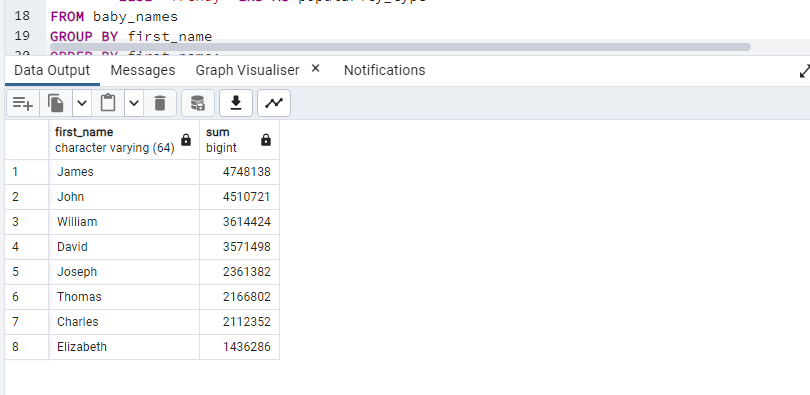
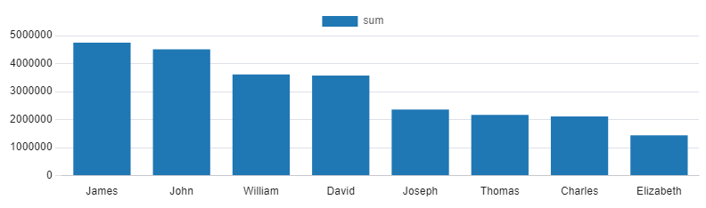
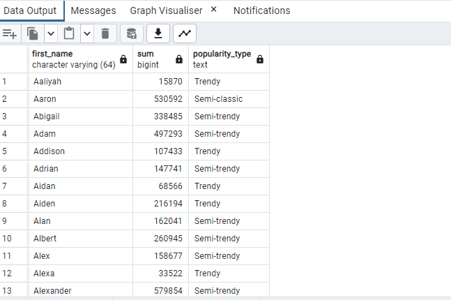
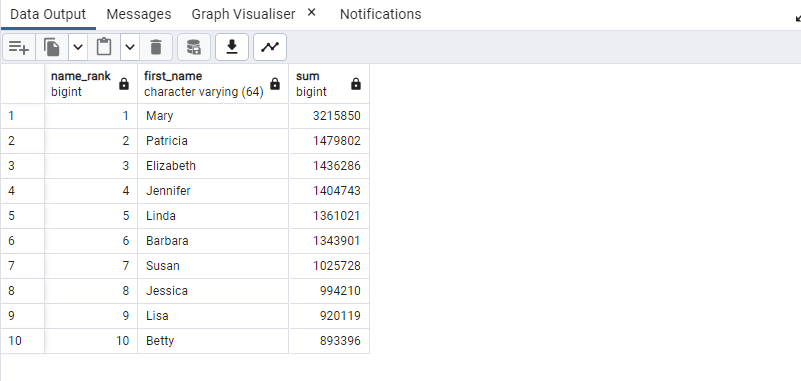
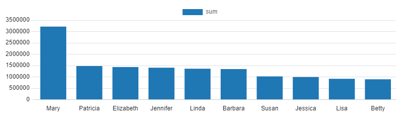
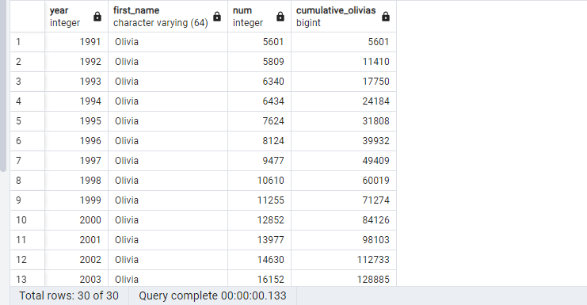
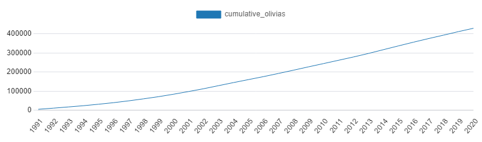
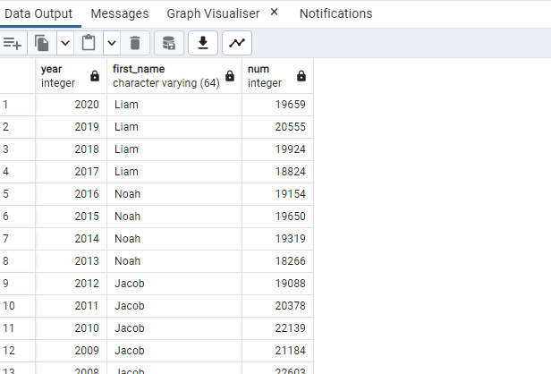
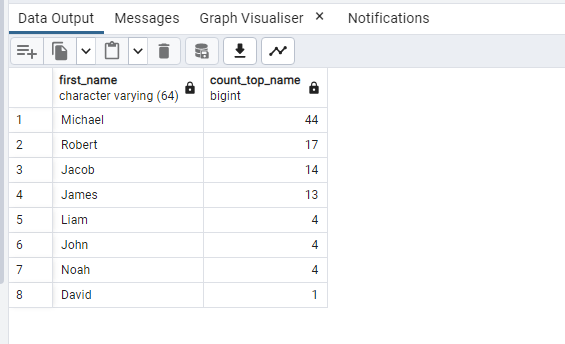
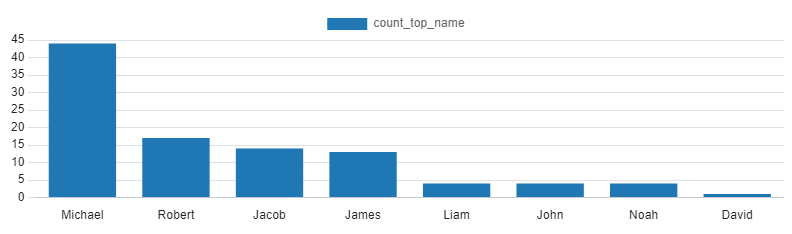

># SQL-Analyzing-American-baby-name-trends
## What makes name timeless or trendy?
Using data published by the U.S. Social Security Administration spanning over a **hundred years** to understand American baby name tastes.

## Creating and importing data 

```
DROP TABLE baby_names;

CREATE TABLE baby_names (
  year INT,
  first_name VARCHAR(64),
  sex VARCHAR(64),
  num INT
);

\copy baby_names FROM 'usa_baby_names.csv' DELIMITER ',' CSV HEADER;
```
-----------------

------------------------
## 1 : looking at the names that have stood the test of time!
```
select first_name,sum(num)
from baby_names
-- Group by first_name and filter for those names that appear in all 101 years
group by first_name
having count(distinct year)>=101
-- Order by the total number of babies with that first_name, descending
order by sum(num) desc;
```
------------------------


-----------------------------------
## 2 : Was the name classic and popular across many years or trendy, only popular for a few years? 
```
SELECT first_name, SUM(num),
    CASE WHEN COUNT(year) > 80 THEN 'Classic'
        WHEN COUNT(year) > 50 THEN 'Semi-classic'
        WHEN COUNT(year) > 20 THEN 'Semi-trendy'
        ELSE 'Trendy' END AS popularity_type
FROM baby_names
GROUP BY first_name
ORDER BY first_name;

```
------------------------

------------------------
## 3 : Top-ranked female names since 1920
```
SELECT
    RANK() OVER(ORDER BY SUM(num) DESC) AS name_rank,
    first_name, SUM(num)
FROM baby_names
WHERE sex = 'F'
GROUP BY first_name
LIMIT 10;
```
---------------


------------------------
## 4 : Picking a female baby name ends with 'a'
```
select first_name
from baby_names
where sex='F' and year>2015 and first_name like '%a'
group by first_name
order by sum(num) desc;
```
------------------------

---------------------------
## 5 : the rise of the name Olivia 'the most common name'
```
SELECT year, first_name, num,
    SUM(num) OVER (ORDER BY year) AS cumulative_olivias
FROM baby_names
WHERE first_name = 'Olivia'
ORDER BY year;
```
----------------------

--------------------------
## 6 : traditionally male names
```
select year,max(num) as max_num
from baby_names
where sex='M'
group by year;
```
------------------

---------------------------
## 7 : Top male names over the years
```
SELECT b.year, b.first_name, b.num
FROM baby_names AS b
INNER JOIN (
    SELECT year, MAX(num) as max_num
    FROM baby_names
    WHERE sex = 'M'
    GROUP BY year) AS subquery 
ON subquery.year = b.year 
    AND subquery.max_num = b.num
ORDER BY year DESC;
```
----------------------------


------------------------------------
## 8 : The most years at number one
```

WITH top_male_names AS (
    SELECT b.year, b.first_name, b.num
    FROM baby_names AS b
    INNER JOIN (
        SELECT year, MAX(num) num
        FROM baby_names
        WHERE sex = 'M'
        GROUP BY year) AS subquery 
    ON subquery.year = b.year 
        AND subquery.num = b.num
    ORDER BY YEAR DESC
    )
SELECT first_name, COUNT(first_name) as count_top_name
FROM top_male_names
GROUP BY first_name
ORDER BY COUNT(first_name) DESC;

```
-----------------------------


-------------------------------
### THANK YOU♥
